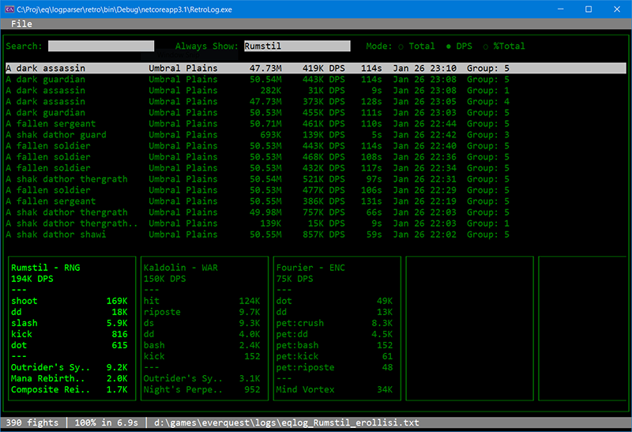

```
   __      _               __             
  /__\ ___| |_ _ __ ___   / /  ___   __ _ 
 / \/// _ \ __| '__/ _ \ / /  / _ \ / _` |
/ _  \  __/ |_| | | (_) / /__| (_) | (_| |
\/ \_/\___|\__|_|  \___/\____/\___/ \__, |
                                    |___/ 
                                                      
A DOS-like log parser for a game that's barely out of the DOS era.

```




# Prerequisite

In order to run the parser you will need to have the Microsoft .NET Core 3.1 Runtime installed on your computer. You can download it from Microsoft here:

https://dotnet.microsoft.com/download/dotnet-core/thank-you/runtime-desktop-3.1.10-windows-x86-installer

# Download

Once you've updated your system with the .NET Core runtime, you can download the parser from here:

https://s3.amazonaws.com/raidloot/retrolog.exe
